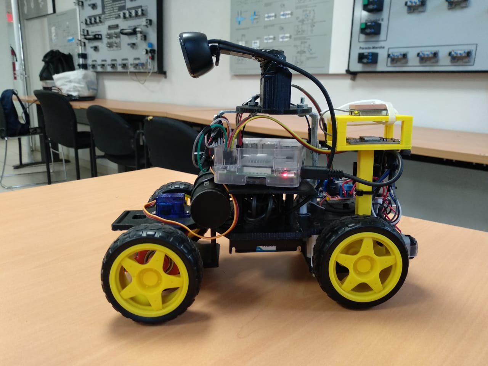
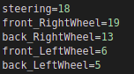
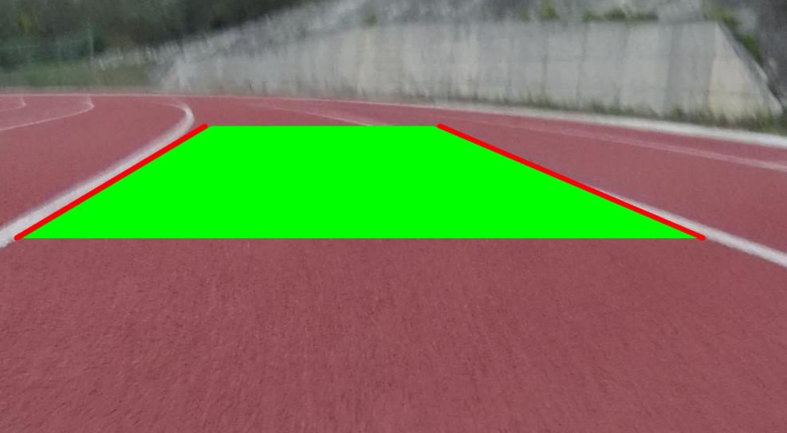

# Self Driving Car

This is a python project for a self driving car using a camera in a raspberry, this car have ackerman configuration, use two dc motor, and one servomotor for the direction.
In this project we use camera filters in order to detect de track and get the direction that the car may take.

 

GPIO configurations (the steering is the pwm signal for the servomotor the other pins are for the directions of the two motor):

  


## Getting Started

For the use of this code we will need some libraries, a mono-camera, python3 and a raspberry with GPIO library.

### Prerequisites

For the compile we will need some libraries for python3.

* Numpy
```
pip3 install numpy
```

* Opencv
```
sudo apt update
sudo apt install python3-opencv
```

* RPI.GPIO
```
sudo apt-get install rpi.gpio
```


### Installing


Download the project

```
git clone https://github.com/AngelVelazquezR/SelfDrivingCar.git
```

## Running the tests

For running a test we have to go to SelfDrive folder.

```
cd SelfDrivingCar
cd selfDrive
```
And running the the autonomo.py with all motors connected in the right configurations. Then the car will find the correct track beetween two lines


```
python3 autonomo.py
```

### Main executed

These are some results of a track, when the green section is the safe way.

 
 


## Authors

* **Angel Velazquez** - *Initial work* - [GitHub](https://github.com/AngelVelazquezR)

